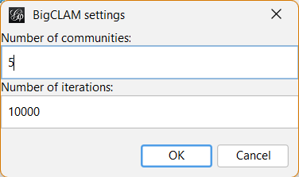
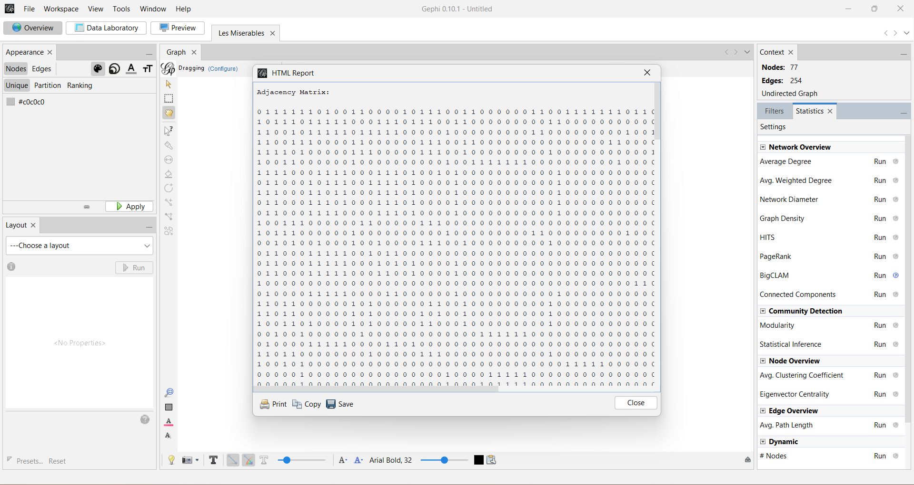
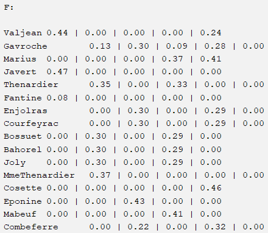

# BigCLAM Method

The **BigCLAM** (**Big**  **C**ommunity **L**arge **A**djacency **M**atrix) method is a powerful algorithm used for community detection in networks. This method is particularly efficient for analyzing large-scale networks with millions of nodes and edges. BigCLAM aims to identify **overlapping communities** within networks by modeling the network as a bipartite graph and optimizing the likelihood of node memberships in multiple communities. By leveraging the BigCLAM method, researchers and analysts can gain valuable insights into the intricate community structures, dynamics, and interactions within complex networks, making it a valuable tool for network analysis and understanding network phenomena.

## History

I developed another plugin named[ CPM plugin](https://github.com/mirsamantajbakhsh/CliquePercolationMethod) during my PhD studies at [Urmia University](https://urmia.ac.ir) in the field of IT. While working on community detection, I realized that there was no existing Gephi plugin to visualize overlapping communities. Consequently, I created CPM plugin for Gephi. We have updated CPM plugin with [Ebrahim Shami](https://github.com/qfewzz) 

After updating the CPM Plugin, we have decided to develope BigCLAM method for Gephi too.

```shell
$ whoami
mirsamantajbakhsh
```

I currently serve as an Assistant Professor in Computer Engineering at Urmia University. My research interests include Social Network Analysis, Big Data Mining, NLP, and, outside academia, playing the guitar, enjoying nature, and exploring Android development. You can find more about me on [my website](https://mstajbakhsh.ir).

## Sample Run

I tested this plugin using the "Les Misérables" sample graph in Gephi.



The HTML report:

```html
Valjean    0.44 | 0.00 | 0.00 | 0.00 | 0.24
Gavroche    0.13 | 0.30 | 0.09 | 0.28 | 0.00
Marius    0.00 | 0.00 | 0.00 | 0.37 | 0.41
Javert    0.47 | 0.00 | 0.00 | 0.00 | 0.00
Thenardier    0.35 | 0.00 | 0.33 | 0.00 | 0.00
Fantine    0.08 | 0.00 | 0.00 | 0.00 | 0.00
Enjolras    0.00 | 0.30 | 0.00 | 0.29 | 0.00
Courfeyrac    0.00 | 0.30 | 0.00 | 0.29 | 0.00
Bossuet    0.00 | 0.30 | 0.00 | 0.29 | 0.00
Bahorel    0.00 | 0.30 | 0.00 | 0.29 | 0.00
Joly    0.00 | 0.30 | 0.00 | 0.29 | 0.00
MmeThenardier    0.37 | 0.00 | 0.00 | 0.00 | 0.00
Cosette    0.00 | 0.00 | 0.00 | 0.00 | 0.46
Eponine    0.00 | 0.00 | 0.43 | 0.00 | 0.00
Mabeuf    0.00 | 0.00 | 0.00 | 0.41 | 0.00
Combeferre    0.00 | 0.22 | 0.00 | 0.32 | 0.00
Feuilly    0.00 | 0.22 | 0.00 | 0.32 | 0.00
Myriel    0.00 | 0.00 | 0.00 | 0.00 | 0.00
Grantaire    0.00 | 0.43 | 0.00 | 0.00 | 0.00
Gueulemer    0.32 | 0.00 | 0.34 | 0.00 | 0.00
Babet    0.32 | 0.00 | 0.34 | 0.00 | 0.00
Claquesous    0.28 | 0.00 | 0.32 | 0.00 | 0.00
Tholomyes    0.00 | 0.00 | 0.00 | 0.00 | 0.00
Prouvaire    0.00 | 0.35 | 0.00 | 0.02 | 0.00
Montparnasse    0.16 | 0.00 | 0.40 | 0.00 | 0.00
Bamatabois    0.00 | 0.00 | 0.00 | 0.00 | 0.00
Listolier    0.00 | 0.00 | 0.00 | 0.00 | 0.00
Fameuil    0.00 | 0.00 | 0.00 | 0.00 | 0.00
Blacheville    0.00 | 0.00 | 0.00 | 0.00 | 0.00
Favourite    0.00 | 0.00 | 0.00 | 0.00 | 0.00
Dahlia    0.00 | 0.00 | 0.00 | 0.00 | 0.00
Zephine    0.00 | 0.00 | 0.00 | 0.00 | 0.00
Gillenormand    0.00 | 0.00 | 0.00 | 0.00 | 0.46
MlleGillenormand    0.00 | 0.00 | 0.00 | 0.00 | 0.46
Brujon    0.00 | 0.00 | 0.46 | 0.00 | 0.00
MmeHucheloup    0.00 | 0.21 | 0.00 | 0.00 | 0.00
Judge    0.00 | 0.00 | 0.00 | 0.00 | 0.00
Champmathieu    0.00 | 0.00 | 0.00 | 0.00 | 0.00
Brevet    0.00 | 0.00 | 0.00 | 0.00 | 0.00
Chenildieu    0.00 | 0.00 | 0.00 | 0.00 | 0.00
Cochepaille    0.00 | 0.00 | 0.00 | 0.00 | 0.00
Fauchelevent    0.00 | 0.00 | 0.00 | 0.00 | 0.00
Simplice    0.00 | 0.00 | 0.00 | 0.00 | 0.00
LtGillenormand    0.00 | 0.00 | 0.00 | 0.00 | 0.37
MlleBaptistine    0.00 | 0.00 | 0.00 | 0.00 | 0.00
MmeMagloire    0.00 | 0.00 | 0.00 | 0.00 | 0.00
Pontmercy    0.00 | 0.00 | 0.00 | 0.00 | 0.00
Anzelma    0.00 | 0.00 | 0.00 | 0.00 | 0.00
Woman2    0.00 | 0.00 | 0.00 | 0.00 | 0.00
Toussaint    0.00 | 0.00 | 0.00 | 0.00 | 0.00
Marguerite    0.00 | 0.00 | 0.00 | 0.00 | 0.00
Perpetue    0.00 | 0.00 | 0.00 | 0.00 | 0.00
Woman1    0.00 | 0.00 | 0.00 | 0.00 | 0.00
MotherInnocent    0.00 | 0.00 | 0.00 | 0.00 | 0.00
MmeBurgon    0.00 | 0.00 | 0.00 | 0.00 | 0.00
Magnon    0.00 | 0.00 | 0.00 | 0.00 | 0.00
MmePontmercy    0.00 | 0.00 | 0.00 | 0.00 | 0.00
BaronessT    0.00 | 0.00 | 0.00 | 0.00 | 0.00
Child1    0.00 | 0.00 | 0.00 | 0.00 | 0.00
Child2    0.00 | 0.00 | 0.00 | 0.00 | 0.00
Napoleon    0.00 | 0.00 | 0.00 | 0.00 | 0.00
CountessDeLo    0.00 | 0.00 | 0.00 | 0.00 | 0.00
Geborand    0.00 | 0.00 | 0.00 | 0.00 | 0.00
Champtercier    0.00 | 0.00 | 0.00 | 0.00 | 0.00
Cravatte    0.00 | 0.00 | 0.00 | 0.00 | 0.00
Count    0.00 | 0.00 | 0.00 | 0.00 | 0.00
OldMan    0.00 | 0.00 | 0.00 | 0.00 | 0.00
Labarre    0.00 | 0.00 | 0.00 | 0.00 | 0.00
MmeDeR    0.00 | 0.00 | 0.00 | 0.00 | 0.00
Isabeau    0.00 | 0.00 | 0.00 | 0.00 | 0.00
Gervais    0.00 | 0.00 | 0.00 | 0.00 | 0.00
Scaufflaire    0.00 | 0.00 | 0.00 | 0.00 | 0.00
Boulatruelle    0.00 | 0.00 | 0.00 | 0.00 | 0.00
Gribier    0.00 | 0.00 | 0.00 | 0.00 | 0.00
Jondrette    0.00 | 0.00 | 0.00 | 0.00 | 0.00
MlleVaubois    0.00 | 0.00 | 0.00 | 0.00 | 0.00
MotherPlutarch    0.00 | 0.00 | 0.00 | 0.00 | 0.00
```

The output result:


## Download

You can find the latest version of the plugin on the [RELEASE](https://github.com/mirsamantajbakhsh/BigCLAM/releases/download/Main) page.

## Reference

Jaewon Yang and Jure Leskovec. 2013. Overlapping community detection at scale: a nonnegative matrix factorization approach. In Proceedings of the sixth ACM international conference on Web search and data mining (WSDM '13). Association for Computing Machinery, New York, NY, USA, 587–596.